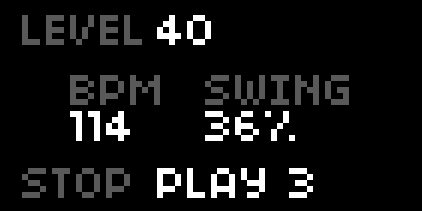

# Step

Sample based, grid controlled step sequencer

## Features

- 8 voice sample playback.
- Tempo and swing.
- Bottom row (row 8) optionally used to cut playback position.

## Operation

- `ENC1` adjusts main output level.
- `ENC2` changes tempo (20-300 BPM).
- `ENC3` changes swing amount (0-100%).
- `KEY2` stops sequencer.
- `KEY3` starts sequencer.
- `GRID` toggles trigs.
- `ARC` changes tempo (`ENC1`) and swing amount (`ENC2`).

## Grid Support

Step is designed for varibright grids. It utilizes 8 rows and 8 or 16 columns of buttons.

## Arc Support

Step provides optional support for arc. It currently only uses the first two encoders for control of tempo and swing.

## Options

Options are available in the global parameters list.

Script options:

- `pattern length` - 8 or 16. Pattern length is automatically changed to connected grid's width.
- `patterns` - 1..99. Selects which pattern to edit and play.
- `last row cuts` - Yes or No. If yes row 8 will cut playhead position.
- `quantize cutting` - Yes or No. If yes playhead position cutting will be quantized to one step.
- `beats per pattern` - 1..8.
- `tempo` - 20-300 BPM.
- `swing amount` - amount to swing odd steps (0-100%).

The script exposes [`Ack` engine parameters](https://github.com/antonhornquist/ack/blob/master/README.md#default-parameters) for each channel.

