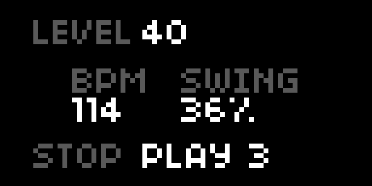

---
---

# Step

Sample based, grid controlled step sequencer

## Features

- 8 voice sample playback.
- Tempo and swing.
- Bottom row (row 8) optionally used to cut playback position.

## Operation

- ENC1 adjusts volume.
- ENC2 changes tempo (20-300 BPM).
- ENC3 changes swing amount (0-100%).
- KEY2 stops sequencer.
- KEY3 starts sequencer.
- GRID toggles trigs.
- ARC changes tempo (ENC1) and swing amount (ENC2) .

## Grid Support

Step is designed for varibright grids. It utilizes 8 rows and 8 or 16 columns of buttons.

## Options

Options are available in the MENU > PARAMETERS list.

Script options:

- `Patterns` - 1..99. Selects which pattern to edit and play.
- `Last Row Cuts` - yes or no. If yes row 8 will cut playhead position.
- `Quantize Cutting` - yes or no. If yes playhead position cutting will be quantized to one step.
- `Beats Per Pattern` - 1..8.
- `Tempo` - 20-300 BPM.
- `Swing Amount` - amount to swing odd steps (0-100%).

The script exposes Ack engine parameters for each channel.

